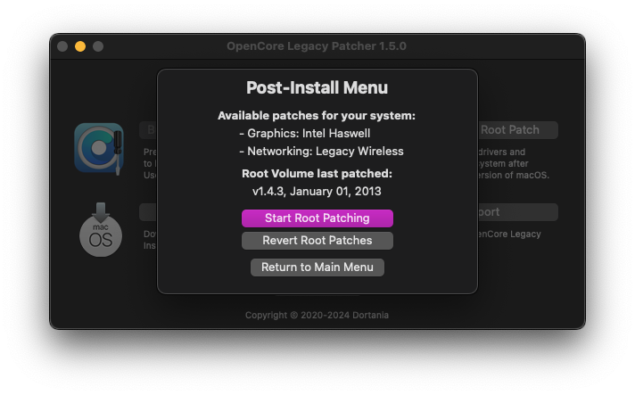

# Acer Aspire E1-572G OpenCore Configuration

[![OpenCore](https://img.shields.io/badge/OpenCore-1.0.1-blue.svg?logo=data:image/png;base64,iVBORw0KGgoAAAANSUhEUgAAAC0AAAAtCAYAAAA6GuKaAAAAAXNSR0IArs4c6QAAAARzQklUCAgICHwIZIgAAAZeSURBVFiFrZjNi1dVGMe/z48phnISy2HKnAJ7mXypcNMmKKSIoG2rFm36DwyjLAgsLC2NCgraWtAmiCAKlUQqopWazUzDOCo5RZaYuchZ5HlaPC/nOefeO7+Z8XfgN/fec88993O+53m7QxhgW/fjzwwCQCwdBKAn179vfYAG9Z5rmui27yc5AhIx0KNWaCKAevZWxvz9D6743St68Najk4weALCAUAe0nUdoYh0sY+c3LX8HlvXA2JEpdjg1A3IwZXGwGro5VuaS47n7lq78kgaOHZ4SZXU0EYAet0ObTVOGJmoZG+8F5c/d0x++12/A2KFpkY31ZweWNXPifI87JnFlWVclE5Dd9H7G+KnjXbMsDXrs4LQQMTmkvC/2LdJMVQAUYKN5NBYGYHxucfBO6NGvp1kUFQUAAkxVUKl2X23qxQRec157h8LfceZY56yt0KNfTTEY4AQwM5gJzDppNAWmplk0VhAHUKkywc1CwgvnKARgYvd0K3gDevTLKUaydwkwmIEEsKxCwRiysmDovIjFqDOWKlt/E5gIWHhmoRW8qbQNYQ7g2pdIF4FKbe3PJJkVkKiB6nYR+prAi7UCeu0X0yJmQrn1QVAkNRfdDfYFctyEEtJIeuoNIeQViakGVrpa7aFiCaxbxdCt12TBMoFOC0riPMyWxUNUkRMUthLTOpl9VOk/Aivs8MfDaGu+rls+l9WQv8AcRM4tQUC3mnoMSzjUk+s/Ht3SubHrJ0+wP2OJqifva1O3DXpm50YCotJJFOHKHiVisES+HoGSdiWSre4B57dt7pvF5jdLphufPS6v6Gk9UqkbXtzZCABu/myaG7HTZiOzQ0u12q1K/fXkpmUXPOOnj7HVHABC9ZfHDB9oN42ZnRt1OENCmkc0EuUT3PE8mlzVsbwyYAA4t2ErXf/Jde6EHDLn8IHhTmBrYh6e9eCJKfsXgTRrmxMRgAtPbVwRsLVTr2yhu/kkg8jNUGJA0vPu6RU6RBQKiygWQG4x3LfMWlpLzFoQkPqJ1ihksbMdntZ8+ktlz0Ajr1XFzsWnr03l2DbsOqGbKl6ZOfS82Ak5GypCKlV5WAdZyWvcg2xsu1xubtXkpsQ2whCHUcTVcC4OeeaBQosNs/11G8xgDAaR+hY4K13AVaVCbEM/XRgwtEYO96sYCyM868IIQ0W9bOjcPC1eMsBWOqMmMjUDO0Y+BjBU1guRLmrMCky6nYNrrIUWmaoaZjstkWBK+wwZMRp7CNyDVtricizW7E5pnNlMepeenSBOrNnQ6mX7qX0kuxZl1uz4ZiDk617+gUVp+SVOSGoe0pfASGDvTzj76lbL+qqgF/72i+kcwFUg3bt+YAEkcYDTczCDU75OKSwiyYvl/0S+9fqRGkFtAb4TQOKE1c8fvib0sZe+4wic4hH5ulQ9QBeQoWiKv+T3yVVYKfjoi98WZtHvl8K5Q19+boJymLPPLM7wifU70PqS3k9Yvf3QssDXvnCU3UbDMStaq5/8/vxrD1UfAV4khQ+BFO5Z2ZcAbLgL6fScV38j2w8yAbi8/4nOmuTmHUcYsLisrZG6y4ihYRt+Kzzm7aaPZti/touFEKJzit0zcHbOZ/eixq5DdUaxWiO9Nip7ivzp8GzuP//Gwz5h8WHLyfK+HfXBGlhDYuIUaoL8qHxmWtK1tXPoqTR1xaXG8GRjt+qiE1Ub+XCWXV2gMBEHDlEl/ToTNdZ62BTUOxRGhF1xdRsqh+eJcGHPIwVnSzlfATcULmpX0PhEM1Qlc9TKuRCigfkPJ3AqE4yUCsnH1K3VcUY+mM3/GkMFHO07QZw2EdJvk1mhaM/kFlwo6epTqWrYE4AIf7+1rcHY6e0j78+yA4P0P6YBGAj/icqZM50P8BEkwlOxjLAAaHUn4y+9/VgrXyc0AKx67xS7I7pt5x+n0kkta4IJ6c+TjQiSmcl6gtIZlojwz77HO9kWhQaAVe/OMZL6ejAPCbpUmk2AjjuTLp5smIwfOTvvf7QZAGFh/+2LcvWFBoBV78yxl6q1yjEkdkC7P4VqsegPVeXCvvV9mZYE7fD75ripMiqIJUBbhLLyAISFvf1hVwRt7ca9p8UVK9OQBS0C7de5/8qb48tmWBG0w+85w9E0XOmWaMO2SI04V3YvH3Yg0HW74fWznAurEvrfXXcO7F3/A3wohpdnVlTnAAAAAElFTkSuQmCC)](https://github.com/acidanthera/OpenCorePkg)

While this was configured to boot up to Sequoia, the most _compatible_ macOS version to run on this device is Big Sur — as some support were stripped out starting Monterey.

See what's [not working](.docs/ISSUES.md).

### 💻 System Specification

| Category       | Component                                  |
|----------------|--------------------------------------------|
| **CPU**        | Intel® Core™ i5-4200U Processor            |
| **iGPU**       | Intel HD Graphics 4400                     |
| **dGPU**       | AMD R7 M265 Disabled; <a href="https://dortania.github.io/GPU-Buyers-Guide/misc/discrete-laptops.html#laptop-dgpus"> not supported</a> |
| **Wi-Fi & BT** | Qualcomm Atheros AR9565                    |
| **Ethernet**   | Broadcom NetXtreme BCM57786                |
| **Audio Codec**| Realtek ALC282 Layout ID: 28 |

# Preparation

### BIOS 

*  **Update BIOS to the** [**latest version**](https://www.acer.com/us-en/support/product-support/Aspire_E1-572G). This resolves the issue of the laptop failing to fully power down when shutting down.
* Configure BIOS with these settings:
	* **Secure Boot** &rarr; **Disabled**
      * You can only toggle this setting if a BIOS password is set. Temporarily add password to set this setting. To remove password, set a new password but leave it blank then save.
	* **F12 Boot** &rarr; **Enabled**

### config.plist

In the config.plist, section <code>PlatformInfo > Generic</code> is currently left empty, [generate your own SMBIOS data](https://github.com/corpnewt/GenSMBIOS). Use a **MacbookPro11,1** SMBIOS.

# Post-Install

* **Do not update AppleALC**. It is compiled to only contain layout 28 of ALC282.

## macOS Monterey - Sequoia  

It requires root-patching with [OCLP](https://github.com/dortania/OpenCore-Legacy-Patcher) to restore Wi-Fi functionality since Monterey, and Graphics Acceleration since Ventura.
-  OCLP requires an internet connection on Sequoia, either via USB tethering or ethernet.

Atheros Bluetooth are not supported since Monterey, use a Bluetooth dongle with supported CSR/Broadcom chipset such as TP Link UB400, and Asus BT400
- Enable **BlueToolFixup.kext** in config.plist if you will be using a Bluetooth dongle.

## macOS Big Sur and earlier
> [!WARNING]  
> This can't be applied for Monterey and newer.

This OC configuration has lifted some security settings, which are necessary for root patching.  **You can leave this config as-is** or re-enable them by:
* Disable `AMFIPass.kext`
* Delete `amfi=0x80` in boot-arg
* Set `csr-active-config` to `00000000`
 * Disable these Kernel -> Patches:
   * Force FileVault on Broken Seal
   * Disable Library Validation Enforcement
   * Disable _csr_check() in _vnode_check_signature
* Set `SecureBootModel` to `Default`, and then **do an NVRAM Reset before booting into macOS**

# Troubleshoot
* Cannot connect to Wi-Fi
	* To work around this, manually connect using the "Other" option in the Wi-Fi menu bar or manually add the network in the "Network" preference pane.
* Multi-boot with Windows
	* Once booted through Windows, Windows' boot manager will always take over the boot order on restart and you'll be unable to boot through OpenCore. To resolve this, [install Bootcamp utilities](https://dortania.github.io/OpenCore-Post-Install/multiboot/bootcamp.html#installation) in Windows after installing macOS (only if you are multi-booting).
	* [Fixing Window features after installing macOS](https://github.com/5T33Z0/OC-Little-Translated/blob/main/I_Windows/Windows_fixes.md)
	* [Use Windows partition under macOS via VMWare](https://github.com/mackonsti/s145-14iwl/blob/master/Fusion.md)

### **License** 

This OpenCore configuration is made of multiple external applications from different people and organizations. [See each program for their licensing](.docs/CREDITS.md).

