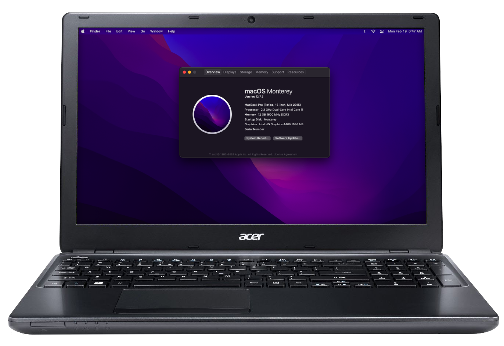

# Acer Aspire E1-572G — OpenCore Configuration

  
  

<strong>Status: Maintained</strong> 
&nbsp;&nbsp;
<a href="https://github.com/unitedastronomer/E1-572G-Hackintosh/archive/refs/heads/main.zip"><strong>Download »</strong></a> 
&nbsp;·&nbsp;
<a href="https://github.com/unitedastronomer/E1-572G-Hackintosh/issues">Report issue</a>
&nbsp;&nbsp;

 

🛠️ This OpenCore configuration is optimized for this specific hardware. 

   * Tested to work from **High Sierra** (10.13) up to **Sonoma** (14)
   * Additional configuration is needed for **Ventura** (13) and **Sonoma** (14)
   * [Read this](assets/INFO.md) for more details.

<h1>💻 System Specification</h1>

<table>
        <tr>
          <th>Category</th>
          <th>Component</th>
        </tr>
        <tr>
          <td><strong>CPU</strong></td>
          <td>Intel® Core™ i5-4200U Processor</td>
        </tr>
        <tr>
          <td><strong>iGPU</strong></td>
          <td>Intel HD Graphics 4400</td>
        </tr>
        <tr>
          <td><strong>dGPU</strong></td>
          <td><i>Unsupported</i></td>
        </tr>
        <tr>
          <td><strong>Wi-Fi & BT</strong></td>
          <td>Qualcomm Atheros AR9565  Limited only up to Big Sur</td>
        </tr>
        <tr>
          <td><strong>Ethernet</strong></td>
          <td>Broadcom NetXtreme BCM57786<i>x</i></td>
        </tr>
        <tr>
          <td><strong>Audio Codec</strong></td>
          <td>Realtek ALC282 Layout 28</td>
        </tr>
</table>

   
<b>⚠️ What's not working?</b>

   
   
🛜 WiFi & Bluetooth on Monterey and newer 
There's no working kext for AR9565 on Monterey and newer

🚀 Graphics Acceleration on Ventura and newer 
Root patching via OCLP is required

💻 Automatic Lid Wake 
Waking up from sleep requires keyboard tap

📲 AirDrop 
; and other Airport related features

🔑 Accessing DRM content 
Use chromium based browsers instead

💨 Fan reading 
(and so under Windows)

   

