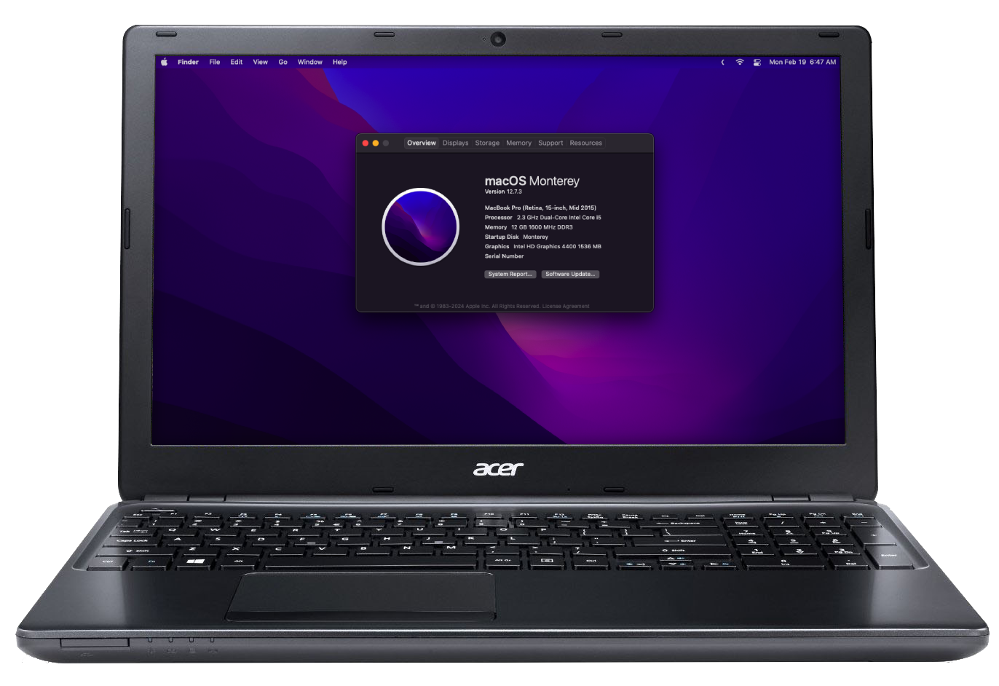

# Acer Aspire E1-572G — Opencore Configuration
[](https://github.com/acidanthera/OpenCorePkg)
[]()




This OpenCore configuration is optimized for this specific hardware.
   * Tested to work from **High Sierra** up to **Monterey**
   * Kexts for WiFi and Bluetooth are not included
   * Not configured for Ventura and newer

### What's not working?
- [ ] AirDrop & other Airport related features
- [ ] Multi-touch gestures (4 fingers)
- [ ] Accessing DRM content (use chromium based browsers instead)
- [ ] WiFi & Bluetooth (macOS 12+)
- [ ] Graphics Acceleration (macOS 13+) 
- [ ] Automatic Lid Wake when at sleep

## Hardware

|**Category**|**Component**|
|------------|-------------|
|**CPU**	 |Intel® Core™ i5-4200U Processor	 	              |
|**iGPU**	 |Intel HD Graphics 4400                              |
|**Wi-Fi/BT**|Qualcomm Atheros AR9565                             |
|**Ethernet**|Broadcom NetXtreme BCM57786                         |
|**Audio** 	 |Realtek ALC282				 	      |

# Requirements
1. **Ethernet** or Android Phone for USB Tethering<br >
   <sup>iPhone USB Tethering does not work in Recovery</sup>
2. USB Drive <br >
<sup>`>=4GB` for Onlline installer</sup>
3.  Replace mPCIe WiFI Card with an Intel one<br >
<sup>`Optional` There's no working kext for AR9565 on Monterey and newer, max speed is ≤ 200 kilobits under Big Sur and earlier.</sup>

# Preparation

### BIOS

Update to the [latest version](https://www.acer.com/us-en/support/product-support/Aspire_E1-572G), this resolves the issue of the laptop failing to fully power down after doing a shutdown under macOS. <br >

Configure the BIOS with these settings:
<table>
          <tr>
            <th>Option</th>
            <th>Setting</th>
          </tr>
          <tr>
            <td>Boot Mode</td>
            <td>UEFI</td>
          </tr>
          <tr>
            <td>SATA Mode</td>
            <td>AHCI</td>
          </tr>
          <tr>
            <td>Secure Boot<e/td>
            <td>Disabled</td>
          </tr>
        </table>
      </td>
      <td>
<table>	

 
### config.plist

In the config.plist, section `PlatformInfo > Generic` is currently left empty, generate your own SMBIOS data. 

1. Download [GenSMBIOS](https://github.com/corpnewt/GenSMBIOS)
3. Open **GenSMBIOS.bat** \(on Windows\)
4. Type `1`, and press enter to install/update MacSerial
5. Type `2`, and press enter to select config.plist
6. Drag and drop **config.plist** file and press enter
7. Type `Y`, **if** "The following keys will be removed..." is prompted
9. Enter `3` and enter to select Generate SMBIOS
10. Type `MacbookPro11,1`, and press enter, the SMBIOS will be automatically apply into your chosen config.plist. <br >
12. While the command prompt still open, type `6` to see Current SMBIOS.

Now enter the serial into the [Apple Check Coverage page](www.checkcoverage.apple.com), you will get 1 of 3 responses:
1. **ⓘ Please enter a valid serial number.** <br >
<sup>This is what we're after</sup>
2. **Valid Purchase Date** <br >
<sup>Avoid!</sup>
4. **Purchase Date not Validated** <br >
<sup>Can also be used, but not recommended as there may be a chance of a conflict with an actual Mac</sup>

If installing Monterey, use `MacbookPro11,4` SMBIOS. You could re-generate and use `MacbookPro11,1` after installation, and add `-no_compat_check` under boot-args. <br >

# Post-Install
Enter the following in terminal, this may resolve laptop randomly not powering down properly on sleep.
```
sudo pmset -a lidwake 0
```
### Troubleshoot
* Unable to [set the boot option back to macOS](https://dortania.github.io/OpenCore-Post-Install/multiboot/bootcamp.html#installation) after booting on windows?
* Stuck on a loop under verbose mode: NVRAM Reset; remove the battery, and press power button for 30 seconds.
* Broadcom Ethernet not detected in any OS: NVRAM Reset; remove the battery, and press power button for 30 seconds.


### Cosmetic

* Disable Verbose Mode: Remove `-v` under NVRAM -> Add > 7C436110-AB2A-4BBB-A880-FE41995C9F82 > boot-args.
* Hide boot picker: Misc -> Boot -> ShowPicker. Set it to **`Disabled`**.
  - Only do if you are not multi-booting.

## macOS Ventura and Sonoma
Use Propertree to configure these settings.
#### Before Installation
* Temporarily generate `iMacPro1,1` SMBIOS in config.plist
* Set `csr-active-config` to `FF0F000`
* Set `SecureBootModel` to `Disabled`
* Add `amfi=0x80` in boot-args
* Download the LATEST Opencore Legacy Patcher
* INSTALL macOS
#### After
* Run OCLP, accept permissions. Then click the reboot when prompted by OCLP app.
* Remove `amfi=0x80`, add `-no_compat_check` and `ipc_control_port _options=0`
* Download [AMFIPass.kext](https://github.com/dortania/OpenCore-Legacy-Patcher/tree/bbc89022704343e55231f59a064acef1e57100bf/payloads/Kexts/Acidanthera), and add to OC/Kexts, then OC Snapshot.
* Generate SMBIOS, use `MacbookPro11,1`.

# This is not a guide, rather than an explanation of what I have added in my config.plist. Please refer to the Dortania Opencore Install Guide
More things are detailed in there that I did not add here.

## BIOS

<table>
    <tr>
      <td>
          <table>
        <p>Configure the BIOS with these settings:</p>
          <tr>
            <th>Option</th>
            <th>Setting</th>
          </tr>
          <tr>
            <td>Boot Mode</td>
            <td>UEFI</td>
          </tr>
          <tr>
            <td>SATA Mode</td>
            <td>AHCI</td>
          </tr>
          <tr>
            <td>Secure Boot<e/td>
            <td>Disabled</td>
          </tr>
        </table>
      </td>
      <td>
        <table>
        <p>Other required settings are non-existent in BIOS, however a workaround is applied in the config.plist:</p>
          <tr>
            <th>Unavailable Option</th>
            <th>Setting</th>
          </tr>
          <tr>
            <td>CFG Lock</td>
            <td>AppleXcpmCfgLock</code> is set to <code>True</code> under <code>Kernel</code> -> <code>Quirks</code></td>
          </tr>
          <tr>
            <td>DVMT</td>
            <td>VRAM patches applied under <code>DeviceProperties</code> -> <code>PciRoot(0x0)/Pci(0x2,0x0)</code></td>
          </tr>
        </table>
      </td>
   </tr>
<table>

* Other required settings are non-existent in BIOS, however some quirks in config.plist are enabled as a workaround.
  * As CFG lock remains locked, theres trade-off of being unable to dynamically adjust CPU frequencies based on usage scenarios.
  * Power Management functionality still works as it is managed by ACPI, and temperature throttling mechanisms.

## ACPI 

<details>
<summary></summary>
    
The **DSDT** (_Differentiated System Description Table_), and **SSDT**s (_Secondary System Description Tables_) are integral parts of your system firmware, containing sets of instructions aimed to:
1. 🔋 Outline hardware devices for recognition (USB ports,  battery, etc.)
2. 💤 Power management (sleep, hibernation, etc.)
3. ⌨️ System events (button presses, power status changes etc.)
   
DSDT holds most of these instructions, while SSDTs holds sumpplentary ones used to further define DSDT.  
#### Patch
 The Patch section in the config.plist is utilized to rename specific elements of the DSDT and subsequently redefine them through an SSDT.


So, what's the purpose of the patch section alongside the SSDT? 🤔 <br >
    
Some methods within the DSDT will not work for macOS, like the brightness keys. When we press `Fn` + `Left`, it triggers the `_Q11` method within the DSDT. However, macOS will not react to this, as it expects a key input of `F14`.

To address this, we patch or rename `_Q11` to `XQ11`. Renaming it alone would render it nonfunctional, so we reintroduce `_Q11` back in a new SSDT and redefine the instructions within the method. Now, if `_Q11` is called, it will now direct to our custom SSDT. 

In our custom SSDT with custom instructions for`_Q11` method, it will check if the OS is macOS - if true, it will return a key input of `F14`, if not return `XQ11`. The `XQ11` method now becomes a child method of the newly defined `_Q11`. This strategy allows for OS-specific customization without sacrificing compatibility across different operating systems. This strategy is way cleaner than manually editing DSDT and other system SSDTs.

</details>

<table>
    <tr>
        <td><b>SSDT&nbsp;&nbsp;&nbsp;&nbsp;&nbsp;&nbsp;&nbsp;&nbsp;&nbsp;&nbsp;&nbsp;&nbsp;&nbsp;&nbsp;&nbsp;&nbsp;&nbsp;&nbsp;&nbsp;&nbsp;&nbsp;&nbsp;&nbsp;&nbsp;&nbsp;&nbsp;&nbsp;&nbsp;&nbsp;&nbsp;&nbsp;&nbsp;&nbsp;&nbsp;&nbsp;&nbsp;</b></td>
        <td><b>Description</b></td>
    </tr>
        <tr>
        <td>
        <b>SSDT-GPRW</b>
        <details>
            <summary>Patches</summary>
            <table>
          <tr>
            <th>Find</th>
            <th>Replace</th>
            <th>Comment</th>
          </tr>
          <tr>
            <td>47505257 02</td>
            <td>58505257 02</td>
            <td>GPRW,2,N to XPRW</td>
          </tr>
        </table>
        </details>
        </td>
    <td>
        Resolves sleep issue, where going to sleep shuts down the laptop instead. 
    </td>
    </tr>
        <tr>
        <td>
        <b>SSDT-KBC0</b>
        <details>
            <summary>Patches</summary>
            <table>
          <tr>
            <th>Find</th>
            <th>Replace</th>
            <th>Comment</th>
          </tr>
          <tr>
            <td>5F513131</td>
            <td>58513131</td>
            <td>_Q11 to XQ11</td>
          </tr>
      <tr>
            <td>5F513132</td>
            <td>58513132</td>
            <td>_Q12 to XQ12</td>
          </tr>
        </table>
        </details>
        </td>
        <td>
    Reroutes brightness key to <b>Fn</b> + <b>Left</b> / <b>Right</b> arrow keys. 
           <ul>
                     <li>Disables <b>Fn</b> + <b>F12</b>, and <b>Pause Break</b>.
                 <ul>
                     <li><b>Fn</b> + <b>F12</b> acts as <b>F14</b>, which is the decrease brightness key in macOS.
                     </li>
                     <li><b>Pause Break</b> acts as <b>F15</b>, which is the increase brightness key in macOS.
                     </li>
                 </ul>
             </li>
          </ul><br />
    </td>
    </tr>
    <tr>
        <td>
        <b>SSDT-HPET</b>
        <details>
            <summary>Patches</summary>
            <table>
          <tr>
            <th>Find</th>
            <th>Replace</th>
            <th>Comment</th>
          </tr>
          <tr>
            <td>275F5354 41</td>
            <td>27585354 41</td>
            <td>HPET _STA to XSTA</td>
          </tr>
      <tr>
            <td>46055F43 5253</td>
            <td>46055843 5253</td>
            <td>HPET _CRS to XCRS</td>
          </tr>
      <tr>
            <td>22040079 00</td>
            <td>22000079 00</td>
            <td>IPIC IRQ Patch</td>
          </tr>
      <tr>
            <td>22000179 00</td>
            <td>22000079 00</td>
            <td>RTC IRQ Patch</td>
          </tr>
      <tr>
            <td>22010079 00</td>
            <td>22000079 00</td>
            <td>TIMR IRQ Patch</td>
          </tr>
        </table>
        </details>
        </td>
        <td>
        Resolves audio device not being detected.<br /><br />
    </td>
    </tr>
    <tr>
        <td>
        <p><b>SSDT-EC</b>
        </td>
     <td>
        Provides macOS a dummy Embedded Controller.    
        </td>
    </tr>
     <tr>
        <td>
        <b>SSDT-PLUG</b>
        </td>
        <td>
        Enables CPU Power Management.
        </td>
    </tr>
    <tr>
        <td>
        <b>SSDT-ALS0</b>
        </td>
    <td>
        Provides macOS with a fake Ambient Light Sensor device (ALS), so it could store the current brightness level and keep it after reboots.
    </td>
    </tr>
    <tr>
        <td>
        <b>SSDT-SBUS-MCHC</b>
        </td>
    <td>
        Apparently fixes AppleSMBus support, I only added MCHC as SBUS is already present in the DSDT.
    </td>
    </tr>
    <tr>
        <td>
        <b>SSDT-dGPU_OFF</b>
        </td>
    <td>
        Disables unsupported dGPU.
    </td>
    </tr>
    <tr>
        <td>
        <b>SSDT-EHCx_OFF</b>
        </td>
    <td>
        <i>Optional</i>, disables the EHC1 controller.
    </td>
    </tr>
</table>

#### The **E1-572G.aml** in the EFI is a combination of all SSDTs mentioned above.
<br >

## Device Properties

<table>
    <tr>
      <td>
        <p><b>Display Controller</b>:<br />
            <code>PciRoot(0x0)/Pci(0x1B,0x0)</code><br /><br />
            <code>framebuffer-con1-type</code> sets the correct connector type for DisplayPort.<br />
                 <ul>
                     <li>The VGA port is actually a DisplayPort internally</li>
                     <li>I have not tested this, if it does not work, you may need to set the correct bus ID for it. Not guaranteed to work as it maybe hardwired to the dGPU.</li>
                 </ul>
     <code>framebuffer-con2-type</code> sets the correct connector type for HDMI, and resolves HDMI audio.<br /><br />
     <code>enable-backlight-smoother</code> enabling smoother brightness transition when adjusting the brightness.<br /><br />
     <code>backlight-smoother-lowerbound</code> prevents the display from fully going black when brightness is set to the lowest.<br /><br />
          More explanation here:<br />
                     <a href="https://dortania.github.io/OpenCore-Post-Install/gpu-patching/intel-patching/#terminology">Intel iGPU Patching</a>
                      <br />
                     <a href="https://dortania.github.io/OpenCore-Post-Install/gpu-patching/intel-patching/vram.html#creating-our-patch">Patching VRAM</a>
                      <br />
                      <a href="https://dortania.github.io/OpenCore-Post-Install/gpu-patching/intel-patching/busid.html#parsing-the-framebuffer">Patching Bus ID</a>
                      <br /> 
           <a href="https://www.s-manuals.com/pdf/motherboard/compal/compal_la-9531p_r1.0_schematics.pdf">E1-572G Schematics</a>
          <br />
        </p>
      </td>
      <td>
        <table>
          <tr>
            <th>Key*</th>
            <th>Value</th>
            <th>Type</th>
          </tr>
          <tr>
            <td>AAPL,ig-platform-id</td>
            <td>0500260A</td>
            <td>Data</td>
          </tr>
          <tr>
            <td>device-id</td>
            <td>12040000</td>
            <td>Data</td>
          </tr>
          <tr>
            <td>framebuffer-patch-enable</td>
            <td>01000000</td>
            <td>Data</td>
          </tr>
          <tr>
            <td>framebuffer-cursormem</td>
            <td>00009000</td>
            <td>Data</td>
          </tr>
          <tr>
            <td>framebuffer-stolenmem</td>
            <td>00003001</td>
            <td>Data</td>
          </tr>
          <tr>
            <td>framebuffer-fbmem</td>
            <td>00009000</td>
            <td>Data</td>
          </tr>
          <tr>
            <td>framebuffer-con1-enable</td>
            <td>01000000</td>
            <td>Data</td>
          </tr>
           <tr>
            <td>framebuffer-con2-enable</td>
            <td>01000000</td>
            <td>Data</td>
          </tr>
          <tr>
            <td>framebuffer-con1-type</td>
            <td>00040000</td>
            <td>Data</td>
          </tr>
          <tr>
            <td>framebuffer-con2-type</td>
            <td>00080000</td>
            <td>Data</td>
          </tr>
          <tr>
            <td>enable-backlight-smoother</td>
            <td>01000000</td>
            <td>Data</td>
          </tr>
          <tr>
            <td>backlight-smoother-lowerbound</td>
            <td>05000000</td>
            <td>Data</td>
          </tr>
        </table>
      </td>
</tr>
      <tr>
      <td>
        <p><b>Audio Controller</b>:<br /><code>PciRoot(0x0)/Pci(0x1B,0x0)</code>
        </p>
      </td>
      <td>
        <table>
          <tr>
            <th>Key*</th>
            <th>Value</th>
            <th>Type</th>
          </tr>
          <tr>
            <td>layout-id</td>
            <td>28</td>
            <td>Number</td>
          </tr>
        </table>
      </td>
    </tr>
        <tr>
      <td>
        <p><b>Network Controller</b>:<br /><code>PciRoot(0x0)/Pci(0x1C,0x3)/Pci(0x0,0x0)</code>
        <br />
        <br />
        Sets the WiFi as <code>built-in</code>.
        </p>
      </td>
      <td>
        <table>
          <tr>
            <th>Key*</th>
            <th>Value</th>
            <th>Type</th>
          </tr>
          <tr>
            <td>built-in</td>
            <td>01</td>
            <td>Data</td>
          </tr>
        </table>
      </td>
    </tr>
        <tr>
      <td>
        <p><b>Ethernet Controller</b>:<br /><code>PciRoot(0x0)/Pci(0x1C,0x0)/Pci(0x0,0x0)</code>
        <br />
    <br />
        Sets the Ethernet as <code>built-in</code>. <br /><br />
    In combination with Kernel Patch, <code>device-id</code> and <code>compatible</code> is to spoof into a natively supported Broadcom ethernet for Catalina and earlier. AppleBCM577XXEthernet.kext is used for Big Sur and newer.
        </p>
      </td>
      <td>
        <table>
          <tr>
            <th>Key*</th>
            <th>Value</th>
            <th>Type</th>
          </tr>
          <tr>
            <td>built-in</td>
            <td>01</td>
            <td>Data</td>
          </tr>
      <tr>
            <td>compatible</td>
            <td>pci14e4,16b4</td>
            <td>String</td>
          </tr>
      <tr>
            <td>device-id</td>
            <td>B4160000</td>
            <td>Data</td>
          </tr>
        </table>
      </td>
    </tr>
<table>


## Kernel Extensions
This EFI <b>does not</b> contain any kext for the WiFi and BT.<br ><br >

### Kernel -> Add 

<table>
    <tr>
      <th>Kext</th>
      <th>Description</th>
    </tr>
      <tr>
      <td>
        <b>Lilu</b>
      </td>
      <td>
      </td>
    </tr>
        <tr>
        <tr>
      <td>
        <b>WhateverGreen</b>
      </td>
      <td>
      </td>
    </tr>
    <tr>
      <td>
        <b>AppleALC</b>
      </td>
      <td>Compiled specifically for ALC282, Layout ID 28.
      </td>
    </tr>
    <tr>
      <td>
        <b>ECEnabler</b>
      </td>
      <td>
      </td>
    </tr>
    <tr>
      <td>
        <b>VirtualSMC</b>
      </td>
      <td>
      </td>
    </tr>
    <tr>
      <td>
        <b>SMCProcessor</b>
      </td>
      <td>
      </td>
    </tr>
    <tr>
      <td>
        <b>SMCBatteryManager</b>
      </td>
      <td>
      </td>
    </tr>
    <tr>
      <td>
        <b>SMCLightSensor</b>
      </td>
      <td>In combination with SSDT-ALS0. Resolves brightness jump when adjusting brightness, further smoothens brightness transition.
      </td>
    </tr>
    <tr>
      <td>
        <b>VoodooPS2Controller & Plugins</b>
      </td>
      <td>
      </td>
    </tr>
    <tr>
      <td>
        <b>RTCMemoryFixup</b>
      </td>
      <td>In combination of an NVRAM entry <code>rtc-blacklist</code> : <code>B2</code>, resolves where laptop restarts when woken up from sleep.
      </td>
    </tr>
<tr>
      <td>
        <b>HibernationFixup</b>
      </td>
      <td>Adjusted to autohibernate when battery is set to 15%. In combination with the hbfx-ahbm nvram entry.
      </td>
    </tr>
    <tr>
      <td>
        <b>HoRNDIS</b>
      </td>
      <td>Allows USB Tethering from an Android phone.
      </td>
    </tr>
        <tr>
    <tr>
            <td>USBToolBox</td>
            <td rowspan="2" class="merged-cell"> Used instead of USBMap as that is SMBIOS dependent, and breaks if different SMBIOS model is used.
        </tr>
        <tr>
            <td>UTBMap</td>
        </tr>
        <tr>
        </tr>
        <tr>
      <td>
        <b>AppleBCM57XXEthernet</b>
      </td>
      <td>Enables Ethernet for Big Sur and newer.<table>
          <tr>
            <th>MinKernel</th>
            <th>MaxKernel</th>
          </tr>
          <tr>
            <td>20.00.0</td>
            <td></td>
          </tr>
        </table></td>
        </tr>
        <tr>
      </td>
    </tr>  
<table>

### Kernel ->  Patch
Broadcom BCM57786 Patch <br />
(Cosmetic) IOReg model

## NVRAM

**Added NVRAM Entries**:

Under **Add** > `7C436110-AB2A-4BBB-A880-FE41995C9F82`:

| Key* | Value | Type |
| :--- | :--- | :--- |
| SystemAudioVolume | 46 | Data |
| csr-active-config | 00000000  | Data |


   - `SystemAudioVolume` sets the boot chime volume to 70%.
        -  `46` is the Hexadecimal equivalent of 70.
   - `csr-active-config`'s entry `00000000` enabled SIP. FF0F0000 to disable, required for root patching.

<br />

Under **Add** and **Delete** > `4D1FDA02-38C7-4A6A-9CC6-4BCCA8B30102`:
| Key* | Value | Type |
| :--- | :--- | :--- |
| rtc-blacklist | B2 | Data |

- `rtc-blacklist` resolves wake, where it restarts instead of resuming from sleep.
        -  In combination with RTCMemoryFixup.kext


## Miscellaneous

* Even though MacbookPro11,1 is the closest SMBIOS for us, it is only limited up to Big Sur. MacbookPro11,4 is the only Haswell SMBIOS supported on Monterey. Temporarily using a supported SMBIOS is required to install Monterey and newer, just regenerate a new one after installtion with an SMBIOS one closest to our CPU (e.g. MacbookPro11,1) with a `-no_compat_check` boot-arg. 
* WiFi and BT kexts are macOS version sensitive! Utilize MinKernel and MaxKernel if multi-booting
  


## Credits
- [doesprintfwork](https://github.com/doesprintfwork/All-in-one-Vanilla-AMD-Hackintosh-Guide/blob/f1a73610d02397f3291686c127a8918fea40f3ec/prerequisites/amd-clover-config.plist/smbios.md) GenSMBIOS guide
- [Jwise](https://github.com/jwise/HoRNDIS) for HoRNDIS
- [DhinakG](https://github.com/USBToolBox/tool) USBToolbox
- [CorpNewt](https://github.com/corpnewt/SSDTTime) GenSMBIOS and Propertree
- [Dortania](https://dortania.github.io/OpenCore-Install-Guide/config.plist/haswell.html) Guide
- [Acidanthera](https://github.com/acidanthera) Opencore and Lilu-based kexts


etc.


